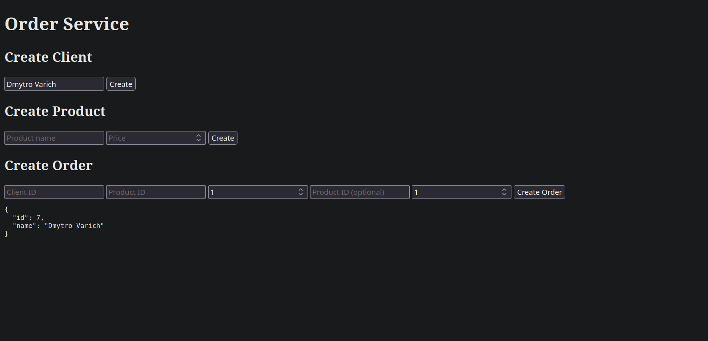

# Order Service

## Description

This project is a simple order management service built with FastAPI.

---

## Technologies

* Python 3
* FastAPI
* SQLAlchemy
* SQLite
* Alembic
* Pytest
* Docker

---

## Project Structure

```text
order-service/
│
├── app/
│   ├── routes/
│   ├── crud.py
│   ├── database.py
│   ├── models.py
│   ├── schemas.py
│   └── main.py
│
├── tests/
├── alembic/
├── Dockerfile
├── docker-compose.yml
├── requirements.txt
└── README.md
```

---

## Run the project

### Local

Install dependencies:

```bash
pip install -r requirements.txt
```

Start the server:

```bash
uvicorn app.main:app --reload
```

Open Swagger:

```text
http://127.0.0.1:8000/docs
```

---

### Docker

Build and run:

```bash
docker-compose up --build
```

---

## Run tests

```bash
pytest
```

---

## Screenshoots



---

## Why this approach

I used FastAPI because it is simple, fast, and provides automatic API documentation.

SQLAlchemy was used as the ORM to work with the database in a clean and structured way.

SQLite was chosen because it is lightweight and fully satisfies the requirements of this task.

The project is divided into separate modules (models, schemas, CRUD, and routes) to keep the code organized and easy to maintain.
