# Diagram

Reference - https://www.markdownlang.com/advanced/diagrams.html

## Sequence Diagram 

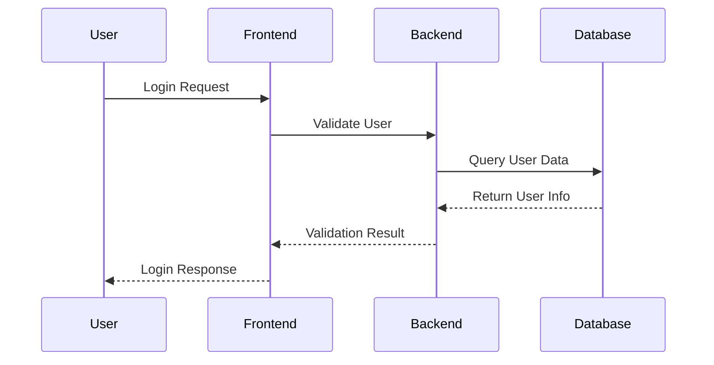

## Flowchart Details

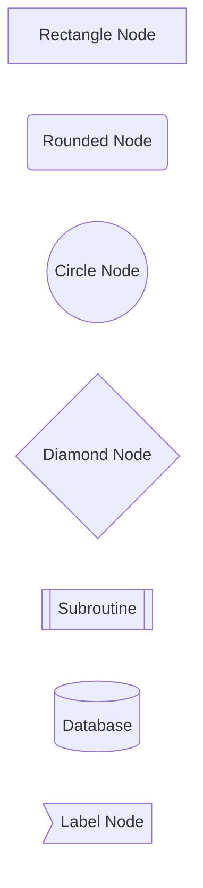

## Complex Flowchart Example

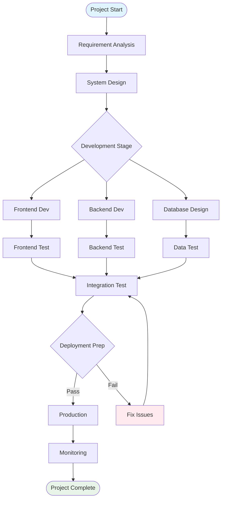

## Sequence Diagram Details

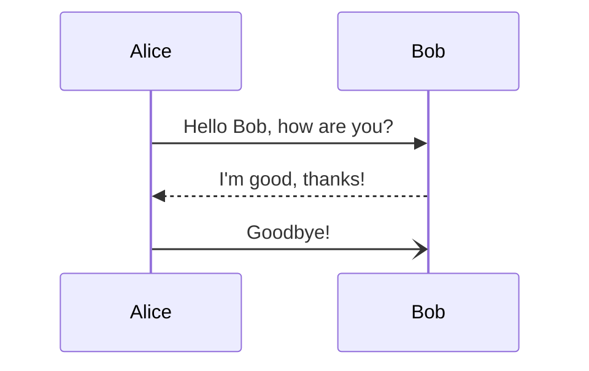

## Activation Bars and Lifelines

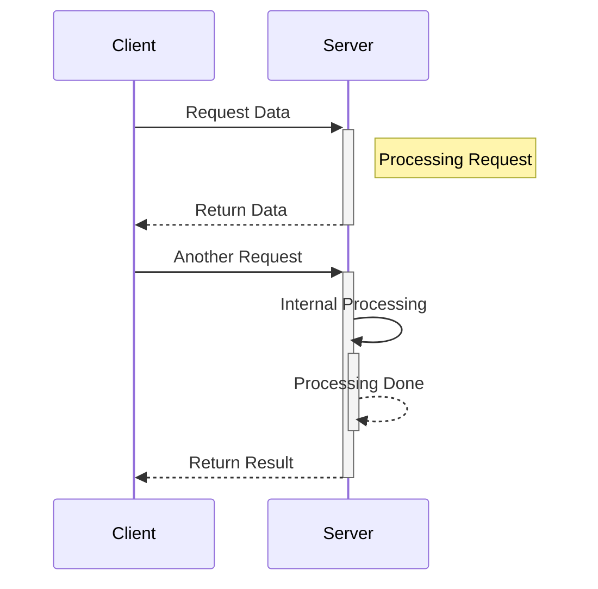

## Loops and Conditions

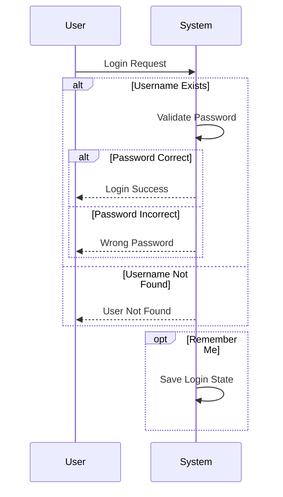

## Class Diagram

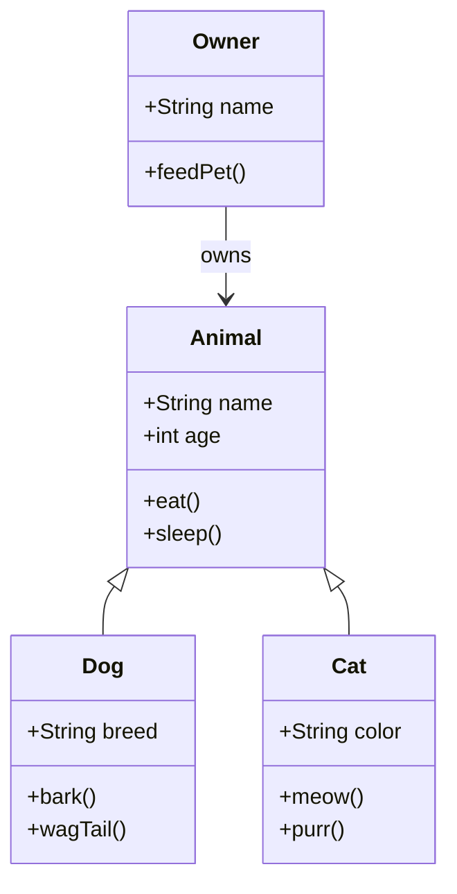

## State Diagram

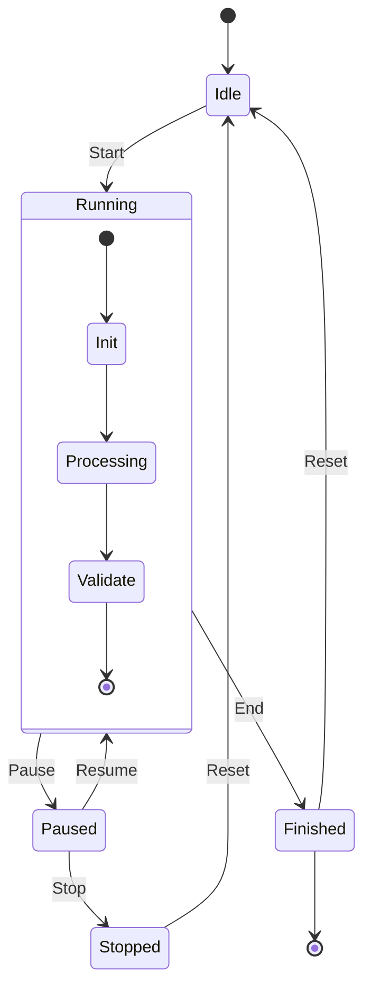

## Gantt Chart

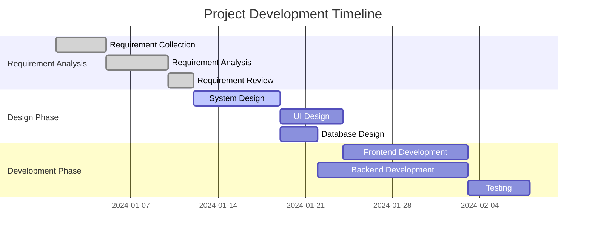

## Pie Chart

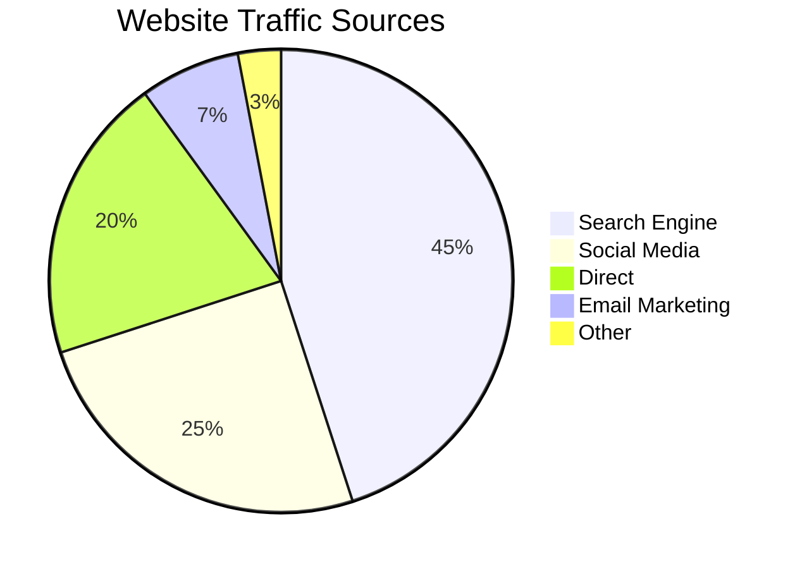

## User Journey

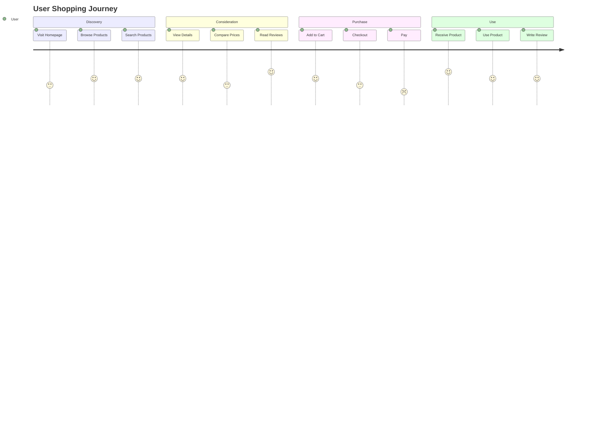

## Real-World Scenarios

### System Architecture Diagram

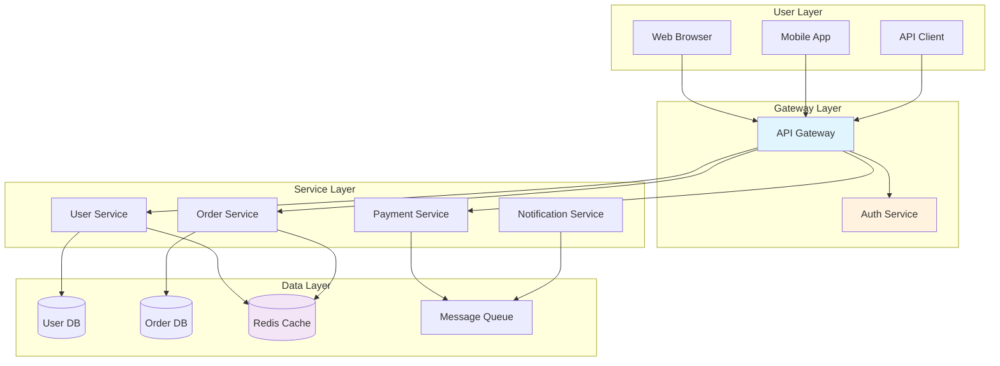

### API Call Flow

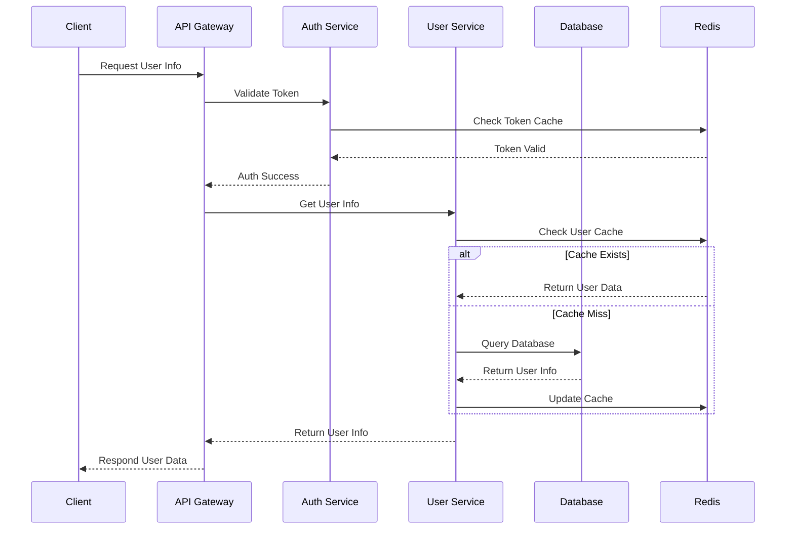

## Styles and Themes

### Node Styles

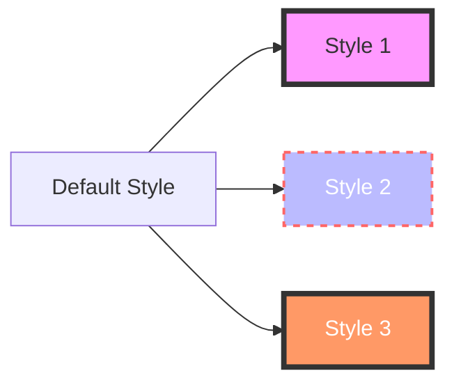

### Class Styles

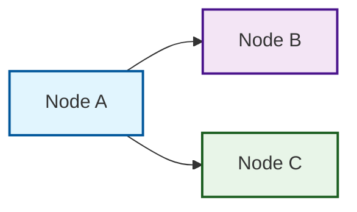

